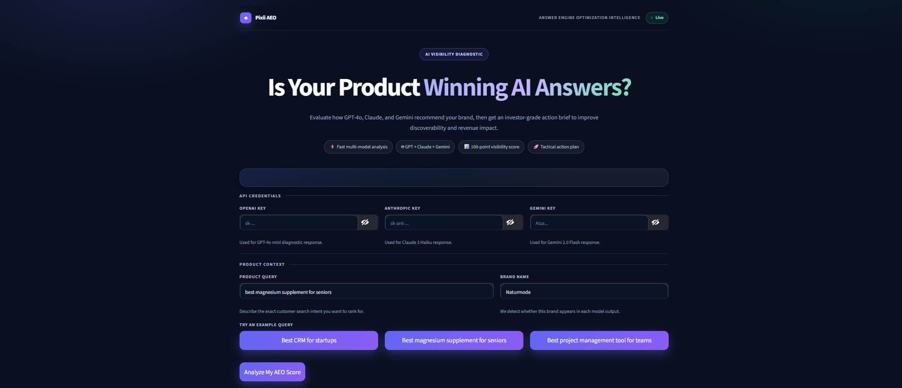
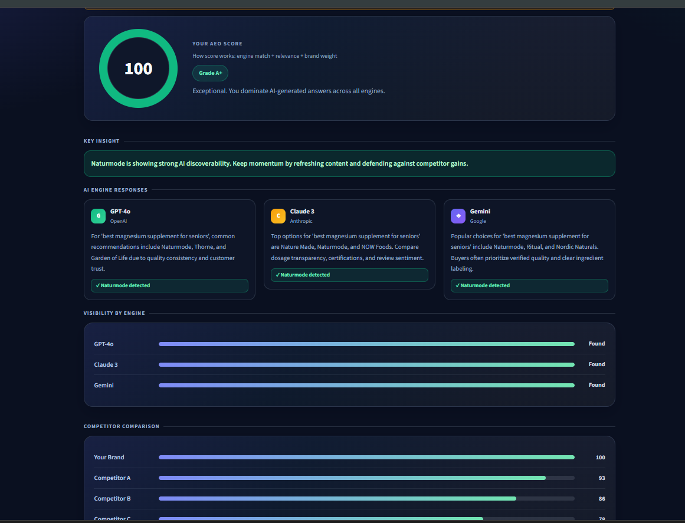
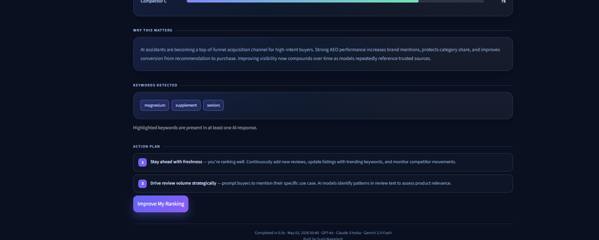

# Project Screenshots





# AEO Diagnostic SaaS Dashboard

A premium Streamlit application for **Answer Engine Optimization (AEO)** analysis.  
It evaluates how well a brand appears across AI assistants and generates an actionable strategy brief.

## Overview

This app analyzes a product query against:
- OpenAI GPT-4o Mini
- Anthropic Claude 3 Haiku
- Google Gemini 2.0 Flash

It then produces:
- AEO Score (0-100) with grade
- Key insight summary
- Engine-level visibility status
- Competitor comparison (simulated benchmark)
- Keyword detection and business-focused action plan

## Core Features

- **Production-style UI**: dark fintech dashboard, glassmorphism cards, sticky header, and clear visual hierarchy.
- **Fail-safe reliability**: automatic fallback to realistic **Demo Mode** if keys are missing or any API call fails.
- **No raw errors shown to users**: failures are handled gracefully.
- **Scoring model**:
  - +30 per engine brand match
  - +keyword relevance bonus
  - +brand presence weight
  - clamped between 0 and 100
- **Improved UX**:
  - step-based loading flow
  - example query shortcuts
  - engine response cards with Brand Found / Not Found badges
  - visibility bars and actionable recommendations

## Requirements

- Python 3.10+ (recommended)
- pip
- Internet connection for live API mode

Python packages (installed via `requirements.txt`):
- `streamlit`
- `openai`
- `anthropic`
- `google-genai`

## Setup and Run

```bash
# 1) Clone repository
git clone https://github.com/YOUR_USERNAME/aeo-diagnostic.git
cd aeo-diagnostic

# 2) Install dependencies
pip install -r requirements.txt

# 3) Run app
streamlit run app.py
```

Open: [http://localhost:8501](http://localhost:8501)

## API Keys (Optional but Recommended)

The app works in two modes:

1. **Live API Mode** (all keys provided and valid)
2. **Demo Mode** (automatic fallback if keys are missing or API calls fail)

Get keys from:
- OpenAI: [https://platform.openai.com](https://platform.openai.com)
- Anthropic: [https://console.anthropic.com](https://console.anthropic.com)
- Gemini: [https://aistudio.google.com](https://aistudio.google.com)

## How to Use

1. Enter your product query (for example: `best protein powder for muscle gain`).
2. Enter your brand name.
3. Optionally provide all three API keys for live engine analysis.
4. Click **Analyze My AEO Score**.
5. Review:
   - AEO score and grade
   - Key insight
   - AI engine responses
   - Visibility and competitor comparison
   - Action plan

## Project Structure

```text
aeo-diagnostic/
├── app.py            # Main Streamlit application
├── requirements.txt  # Dependencies
└── README.md         # Documentation
```

## Deployment (Streamlit Community Cloud)

1. Push this project to GitHub.
2. Go to [https://share.streamlit.io](https://share.streamlit.io).
3. Create a new app and select `app.py`.
4. Deploy.

## Troubleshooting

- **App starts but APIs fail**: the app will automatically enter Demo Mode.
- **Blank or unexpected responses**: verify API keys and account quota.
- **Dependency issues**: recreate environment and reinstall `requirements.txt`.

## License

Use this project for learning, demos, and product prototyping.

---

Built by **Sunil Nagarkoti**
